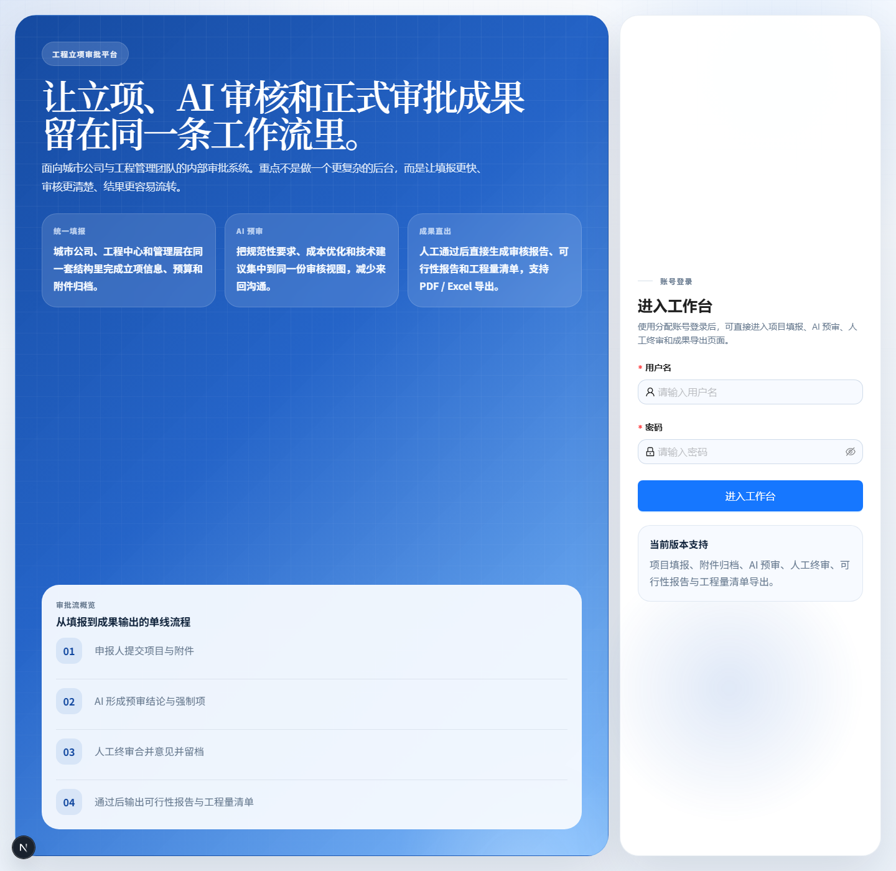
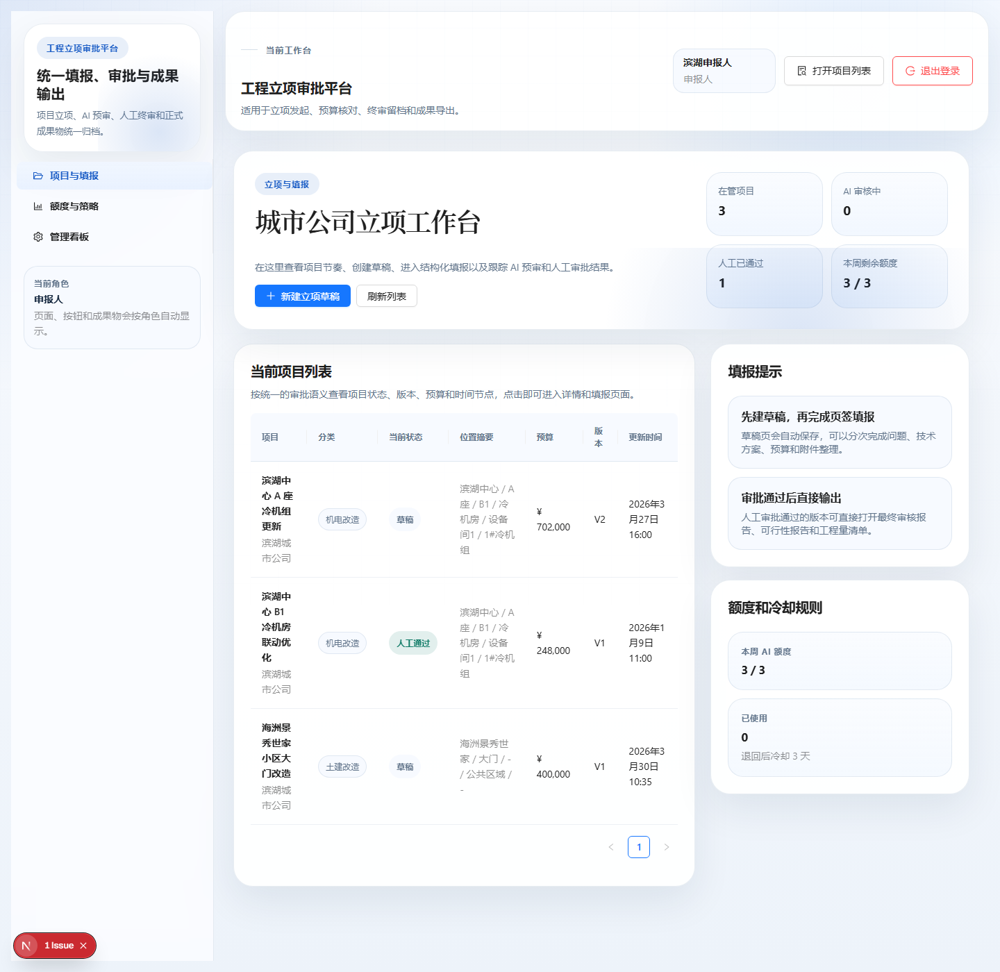
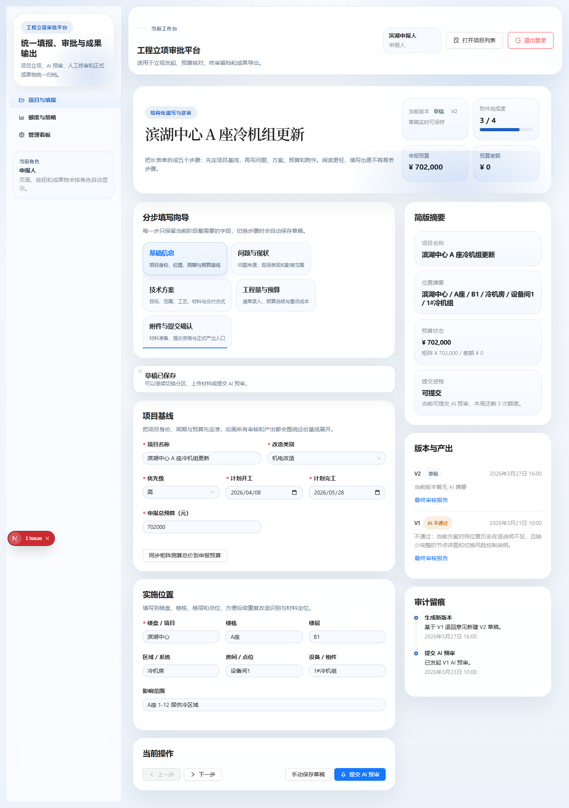
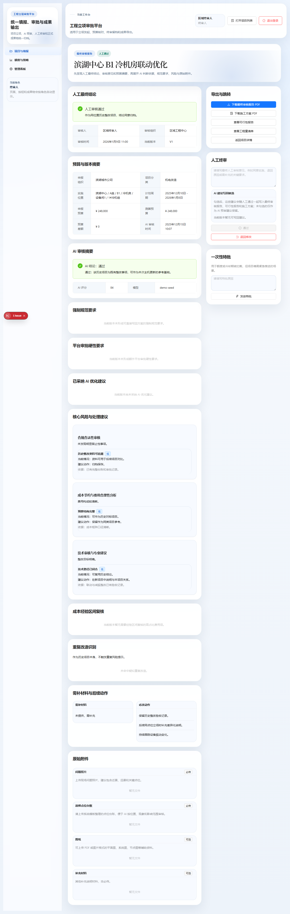
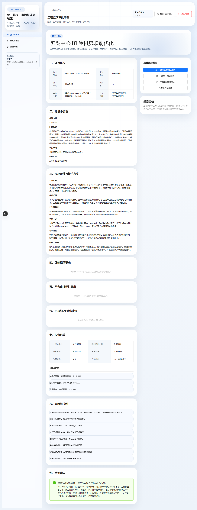
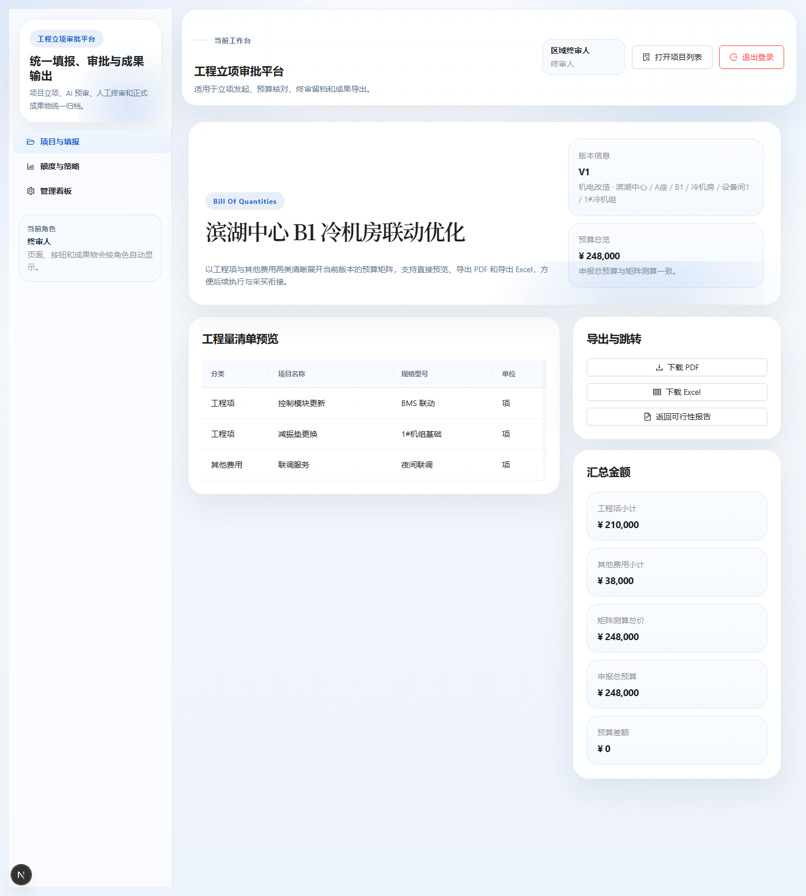
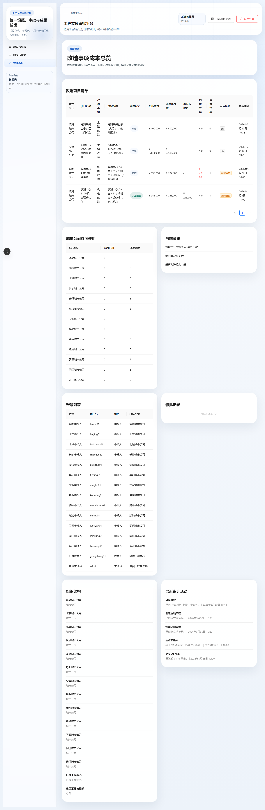

# 工程立项审批平台使用说明书

面向申报人、审核人和管理员的内部使用手册。

## 一、适用对象

- 申报人：创建项目、填写立项信息、上传附件、提交 AI 预审。
- 审核人：查看 AI 结果、填写人工终审意见、选择采纳建议、导出正式成果物。
- 管理员：查看项目总览、额度使用、特批记录、组织与账号信息。

## 二、演示账号

- 申报人：`binhu01 / jinyuan888`
- 审核人：`gongcheng01 / jinyuan888`
- 管理员：`admin / demo123`

> 说明：当前版本以内部试用和演示为主。不同角色登录后，页面上的按钮和可见内容会自动切换。

## 三、快速上手

1. 打开登录页并输入账号密码。
2. 进入工作台后，先到“项目与填报”查看项目列表。
3. 打开项目详情页，按照五个步骤完成填写。
4. 上传附件后提交 AI 预审。
5. 审核通过后，在最终审核报告页和可行性报告页下载正式成果物。

## 四、登录与进入工作台

登录页左侧展示平台定位、流程说明和能力介绍，右侧是登录表单。用户只需要输入用户名和密码即可进入工作台。

### 页面要点

- 登录成功后会自动进入项目列表。
- 如果页面显示 `Failed to fetch`，通常是本地 API 未启动或网络未连通。
- 当前版本不再依赖登录页里的快捷填充按钮，账号需要手动输入。

## 五、申报人填报流程

登录后默认进入“项目与填报”页。这里可以看到项目列表、当前角色、额度概览和新建项目入口。

### 1. 先看项目列表

项目列表会显示项目名称、当前状态、版本、更新时间和可操作入口。申报人可以在这里继续编辑草稿或打开已有项目。

### 2. 打开项目详情

项目详情页被拆成五个步骤：

1. 基础信息
2. 问题与现状
3. 技术方案
4. 工程量与预算
5. 附件与提交确认

每一步只保留当前阶段最需要的字段，切换步骤时会自动保存草稿。

### 3. 填写时的几个重点

- 基础信息：项目名称、类别、优先级、计划工期、预算基线。
- 问题与现状：问题来源、问题描述、当前状态、临时措施、影响范围。
- 技术方案：实施范围、关键工艺、材料选型、验收方式、维护安排。
- 工程量与预算：按清单逐项录入，重点看工程量、单价和合价。
- 附件与提交确认：上传照片、点位台账、图纸、补充材料，再检查提交资格。

### 4. 附件上传和提交

- 单个文件和附件槽位都有大小限制，目的是避免过度消耗审核资源。
- 立项阶段不要求很细的施工图和节点大样，重点是现状、范围、方案、预算和风险边界。
- 填写完成后，提交按钮会触发 AI 预审。

## 六、AI 预审与人工终审

AI 预审页会先展示最终结论、预算摘要和版本信息，再往下展开 AI 判断依据、强制规范要求、平台硬性要求、成本与技术建议。

### 页面怎么读

- 先看“人工最终结论”：这部分是最终审批口径。
- 再看“AI 审核摘要”：用于判断是否存在安全、合规、预算或技术闭环问题。
- 强制规范要求会单独列出，适合直接写回方案。
- AI 建议写回候选需要人工勾选后才会进入正式成果物。

### 人工终审怎么做

审核人可以在右侧填写人工意见，然后选择：

- `通过`
- `退回修改`

如果有可采纳的 AI 建议，可以勾选后再通过。这样这些建议会同步进入最终审核报告、可行性报告和施工方案。

### 一次性特批

当项目因为额度或冷却期被拦截，但确实需要快速推进时，审核人和管理员可以在报告页申请一次性特批。系统会记录特批原因和使用状态。

## 七、正式成果物下载

通过人工终审后，可以下载三类正式成果物：

1. 最终审核报告
2. 可行性报告
3. 工程量清单
4. 施工方案 PDF

### 可行性报告

可行性报告面向汇报和审批归档，结构更完整，包含：

- 项目概况
- 建设必要性
- 问题背景
- 实施条件
- 技术方案
- 投资估算
- 风险与控制
- 结论建议

### 工程量清单

工程量清单按表格方式展示工程项和其他费用，支持：

- 页面预览
- PDF 下载
- Excel 下载

### 施工方案

施工方案是现场执行版成果物，重点说明施工范围、准备工作、工序安排、质量控制、安全文明施工、风险应急和验收交付。它从最终审核报告页或可行性报告页下载。

## 八、管理员与额度管理

管理员登录后可以查看完整项目清单、额度使用、组织架构、账号列表、特批记录和审计留痕。

### 管理看板

这里主要用于看整体项目数量、成本变化、审批状态和最近操作记录。

### 额度中心

额度中心展示各城市公司的本周使用情况和剩余额度。管理员可以据此判断是否需要发放特批、重置额度或调整策略。

## 九、常见问题

### 1. 页面打不开或提示 Failed to fetch 怎么办？

- 先确认本地 API 和前端服务都已启动。
- 如果是演示版或部署版，先确认环境变量和服务地址配置正确。

### 2. 为什么看不到“施工图”和“节点图”的详细要求？

- 立项阶段重点判断必要性、范围、预算和风险边界，不要求招标深度施工图。
- 详细节点做法通常放在招采或施工深化阶段完善。

### 3. 填写后会不会丢失？

- 系统切换步骤时会自动保存草稿。
- 如果上传或提交中断，刷新后通常可以继续从草稿恢复。

### 4. 为什么有些按钮是灰的？

- 这是角色权限或当前状态限制。
- 例如申报人只能编辑草稿，审核人才能做终审和特批。

### 5. 报告页面可以直接下载哪些文件？

- 最终审核报告 PDF
- 可行性报告 PDF
- 工程量清单 PDF
- 工程量清单 Excel
- 施工方案 PDF

## 十、建议的使用顺序

1. 先看登录页和项目列表页，确认自己是什么角色。
2. 再进入项目详情页完成填报。
3. 送审后进入最终审核报告页，先看结论再看建议。
4. 审批通过后下载可行性报告、工程量清单和施工方案。
5. 管理员再去额度中心和管理看板查看整体运行情况。

